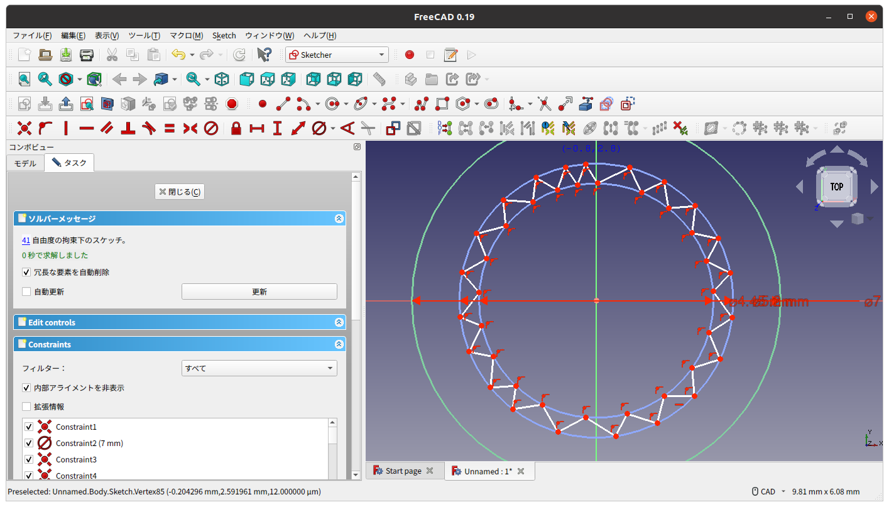
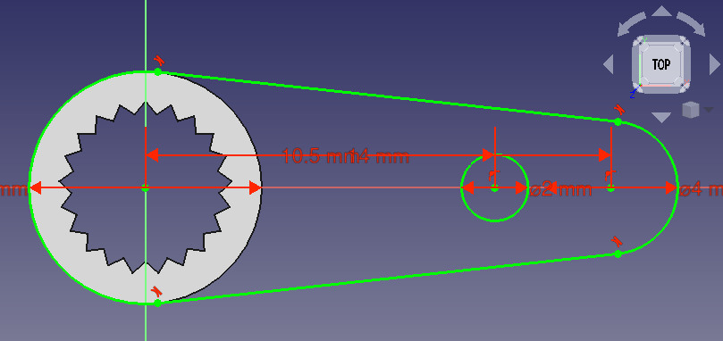

# SG90サーボモータのサーボホーンを3Dプリンタで作ってみる。

サーボホーンを光造形3Dプリンタ(ELEGOO MARS2)で作ってみました。[SG90のギアを測定したサイト](https://www.robotshop.com/community/blog/show/modelling-a-servo-spline)を参考にしています。

注意: 3Dプリンタでのプリントは、設計データと1ミクロンの誤差なくプリントされるものではありません。3Dプリンタの機種や使う樹脂、印刷条件等によって出力のサイズは異なります。ここでの数値はあくまで参考値となり、各自の環境において調整をしてください。

## サーボホーンの作成

造形物の設計データは、オープンソースの3Dモデラーの[FreeCAD](https://www.freecadweb.org/?lang=ja)で作成しました。

1. FreeCADを起動し、ワークベンチを、Part Design  に切り替えます。
2. 新規ボタン  をクリックし、ドキュメントを作成します。
3. 新規スケッチを作成  をクリックして、スケッチを作成します。
4. フィーチャを選択ダイアログで、「XY_Plane」を選択して、「OK」をクリックします。  
    
5. 円を作成ボタン ) をクリックして、原点を中心に円を作成します。  
    
6. 直径拘束 をクリックして、円を選択し直径を7mmに変更します。  
    
7. 補助線モードの切り替え  をクリックして、補助線作成に切り替え、円を作成ボタン  をクリックし、原点中心の円を2つ作成します。  
    
8. 直径拘束 をクリックして、2つの補助線の円の直径をそれぞれ5.2mm、4.45mmに変更します。
9. 補助線モードの切り替え  をクリックして、通常線作成に切り替え、ポリライン作成 [ポリライン](./images/polyline.png) をクリックして、補助線の円の間に、ギアを作成します。外側と内側の円の上で折れ曲がるようにします。ギアの歯の数は21個になるようします。  
    
10. ポリラインに水平拘束や垂直拘束ができてしまった場合は、拘束を右クリックして削除します。
    
11. ギアの全てのポリラインをCtrlキーを押しながらクリックして選択し、 等値拘束  をクリックして線の長さを統一します。  
    
12. Y軸近くのギアの頂点とX軸を選択し、点をオブジェクトに拘束 をクリックします。
    
13. 画面左のコンボビューのタスクタブの閉じるボタンをクリックします。  
    
14. ギアのスケッチを選択し、スケッチの押し出し  をクリックし、長さを2.5mmに設定し、「OK」をクリックします。  
    
15. ギアの上面を選択し、新規スケッチを作成ボタンをクリックします。  
    
16. ギアの外径と同じ円を作成し、その右に直径4mmの円を作成します。  
    
17. 右の円と原点をクリックして選択し、水平距離拘束 をクリックし、長さを14mmに設定します。  
    
18. 直線作成 をクリックし、2つの円の間に2本の直線を作成します。  
    
19. 直線の端の点と最寄りの円を選択し、接線拘束  をクリックし、円と線を接続します。4つの端点を全て円と接続します。
    
20. エッジをトリム をクリックし、内側になっている円周部分を選択して削除します。  
    
21. X軸上の10.5mmの場所に、直径2mmの円を作成します。
    
22. 画面左のタスクタブの「閉じる」ボタンをクリックし、スケッチを終了します。
23. 押し出し をクリックし、長さを1.5mmに設定し、「OK」をクリックします。  
    
24. 画面左のモデルタブで、「Body」を選択し、「ファイル」-「エクスポート」を選択し、ファイルの種類をSTL Meshにしてエクスポートします。

あとは、STLデータを3Dプリンタのスライサー・ソフトでプリントできるようにして、プリントします。

ここで作成した[データはこちら](./data/servo_horn.FCStd)です。

## ギアの寸法の変更

プリントした、サーボホーンのギアの寸法が合わなくて、はめ込めなかったり、はまっても動かしたときに滑ったりする場合は、ギアの補助線の円の径を調整して、うまく噛み合うように変更します。

1. モデルタブのツリーのPadを展開して、ギアのスケッチを右クリックして、「スケッチを編集」を選択します。  
    
2. 補助線の外径、内径の長さの数値をダブルクリックして値を変更します。  
    
