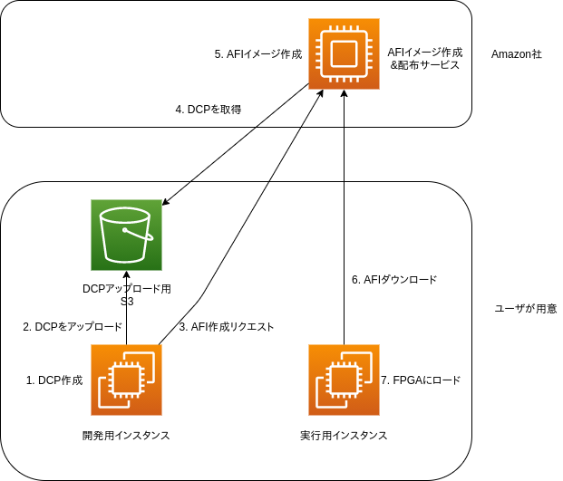

# AWS EC2 F1インスタンス入門

## AWS EC2 F1インスタンスとは

AWS EC2 F1インスタンス(以降、F1インスタンスと省略)とは、EC2インスタンスに[Xilinx UltraScale+ VU9P](https://japan.xilinx.com/products/silicon-devices/fpga/virtex-ultrascale-plus-vu19p.html)ベースのFPGAを搭載したインスタンスです。

FPGA(field-programmable gate array)とは、ユーザが使う現場でプログラム可能な集積回路です。CPUは、工場からの出荷段階で回路を変更できませんが、FPGAは装置の起動時や起動後の実行中に回路の構成を変更できます。FPGAを使ってアプリケーション独自の回路(Custom Logic: CL)を特別にプログラミングすると、そのアプリケーションの用途に限ってはCPUよりも低遅延かつ大量にデータを処理する事ができます。

ムーアの法則の終焉が語られ、CPUのコア単体での処理性能が頭打ちになってきている現在、FPGAを利用して処理性能を向上させる事に注目が集まってきています。

## F1インスタンスでのFPGA利用までの流れ

アプリケーション固有の回路を開発して、F1インスタンスで利用するまでの流れは以下の通りです。

1. FPGAイメージの開発用のEC2インスタンス(以降、開発用インスタンスと呼びます)をセットアップ
2. 開発用インスタンスで、回路のコードをプログラミングし、コードからFPGAイメージの元データ(DCP)をビルドし、S3にアップロードしてFPGAイメージを作成
3. Amazon EC2 F1 インスタンス(以降、実行用F1インスタンスと呼びます)をセットアップ
4. 実行用F1インスタンスでS3にアップロードされたFPGAイメージをロード
5. 実行用F1インスタンスでFPGAの機能を呼び出すプログラムを実行

コードやビルドの成果物は以下のような流れになります。

実行用F1インスタンスで開発用インスタンスを兼用する事もできますが、実行用F1インスタンスの料金は高いので、DCPのビルド作業は料金の安い普通のEC2インスタンス(それでも32GiB以上のメモリが必須)で行います。

例)
| 用途 | インスタンス | 料金 |
| --- | --- | --- |
| 開発用 | z1d.xlarge | 0.372USD/時間 |
| 実行用 | f1.2xlarge | 1.65USD/時間 |

具体的な作業については、[Hello Worldを実行した例](./index.html)を参照してください。

## 開発環境と開発用の言語

開発に使えるツールと、独自回路(Custom Logic)の開発に使える言語は以下の通りです。

| ツール | 言語 |
| --- | --- |
| Vitis/SDAccel | C/C++/OpenCL, Verilog/VHDL |
| Vivado | Verilog/VHDL |
| Vivado HLx | Verilog/VHDL/C |
