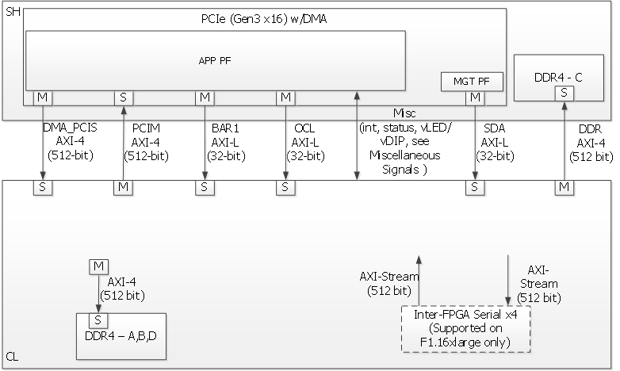

# AWS FPGA Hardware Development Kit (HDK)の使い方

## FPGAの構成

AWS EC2 F1インスタンスのFPGA部分は、大きく以下の2つの部分に分かれています。

* シェル(Shell: SH) - AWSプラットフォームによって実装されたFPGAの周辺回路(PCIe、DRAM、DMA、割込み)
* 独自回路(Custom Logic: CL) - FPGA開発ユーザによって生成された独自の加速回路

開発の最終段階で、ShellとCLが結合されてAmazon FPGA Image(AFI)が作成されます。AFIはF1インスタンスにロードされます。

## アプリケーション・ソフトウェアとShell(SH)とCustom Logic(CL)の関係

アプリケーション・ソフトウェアとSHとCLの関係は以下のようになります。

上図のようにソフトウェアは、SHを経由してCLの機能を利用します。SHには以下の2つのPF(Physical Function)があり、このPFをソフトウェアが利用します：

* Management PF(MgmtPF): 管理用の機能(AFIのロード等)を提供します。
* Application PF(AppPF): CLの機能を利用するためのものです。

MgmtPFを利用するには、Aのshellコマンドや、Bのライブラリ、CのOpenCLのライブラリを使います。
AppPFを利用するには、CのOpenCLのライブラリや、DやEやFのライブラリを使います。

次に、SHとCLは以下のように接続されています。

F1インスタンスとFPGAのSHは[PCIeインタフェース(I/F)](https://ja.wikipedia.org/wiki/PCI_Express)で接続されています。SHとCL間は、主に[AXI-4 I/F](https://ja.wikipedia.org/wiki/Advanced_eXtensible_Interface)で接続されています(つまりSHはPCIeとAXIの変換を行っています)。

左から順に接続を説明していきます。

* DMA_PCIS (AXI-4): F1インスタンスからの、DMA(Direct Memory Access)によるPCIe経由のSlaveのI/Fです。F1インスタンスからの高速なデータの読み書きを実現します。(AppPFのBAR4)
* PCIM (AXI-4): CLからF1インスタンスのメモリの読み書きに使われます。
* BAR1 (AXI-L): CLを使うアプリケーションのレジスタ(Base Address Register)用として使用します。(AppPFのBAR1)
* OCL (AXI-L): CLを使うアプリケーションのレジスタやOpenCLカーネル用に使われます。(AppPFのBAR0)
* Misc(int, status, vLED/vDIP): その他の信号です。
* SDA (AXL-L): AWS OpenCL runtimeライブラリによってパフォーマンス・モニタ用等に使用されたりします。
* DDR (AXI-4): CLからSH内のDDR4 SDRAMにアクセス用に使われます。
